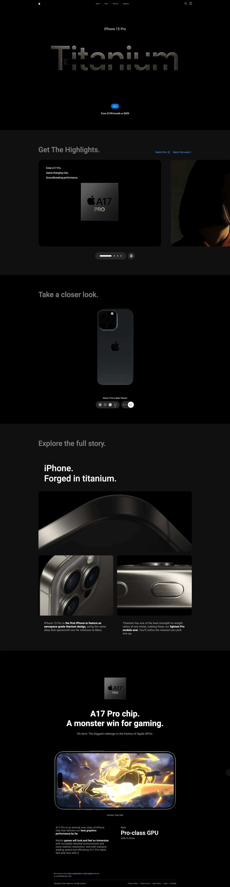

# iPhone15 pro clone

<div align="center">
  <h3 align="center">Iphone 15 Website</h3>
  <p>Build with:</p>
  <div>
    
    
    
    

  </div>
</div>



## 🤸 Quick Start

Follow these steps to set up the project locally on your machine.

**Prerequisites**

Make sure you have the following installed on your machine:

- [Git](https://git-scm.com/)
- [Node.js](https://nodejs.org/en)

**Cloning the Repository**

```bash
git clone https://github.com/hetari/iphone-15-clone

cd iphone-15-clone
```

**Installation**

Install the project dependencies using npm:

```bash
npm install
```

**Running the Project**

```bash
npm run dev
```

Open [http://localhost:5173](http://localhost:5173) in your browser to view the project.
